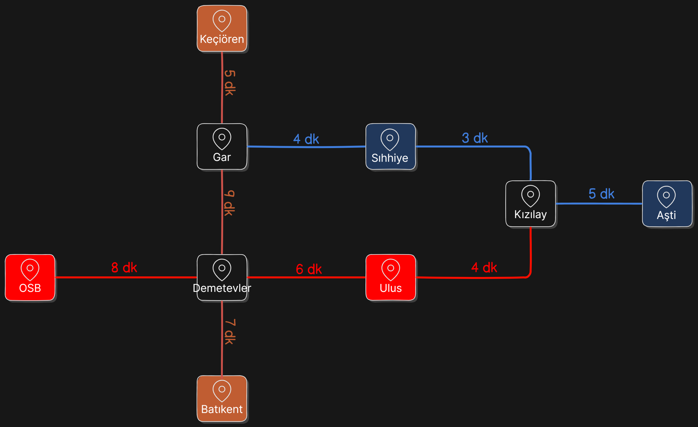

# Sürücüsüz Metro Simülasyonu (Rota Optimizasyonu)

## Global AI Hub Akbank Python ile Yapay Zekaya Giriş Bootcamp bitirme projesidir.

### Kullanılan araçlar

- Python
- heapq
- collection.deque



```
=== Test Senaryoları ===

Senaryo 1: AŞTİ - OSB
En az aktarmalı yol: AŞTİ -> Kızılay -> Kızılay -> Ulus -> Demetevler -> OSB
En hızlı yol (25 dakika): AŞTİ -> Kızılay -> Kızılay -> Ulus -> Demetevler -> OSB

Senaryo 2: Batıkent - Keçiören
En az aktarmalı yol: Batıkent -> Demetevler -> Gar -> Keçiören
En hızlı yol (21 dakika): Batıkent -> Demetevler -> Gar -> Keçiören

Senaryo 3: Keçiören - AŞTİ
En az aktarmalı yol: Keçiören -> Gar -> Gar -> Sıhhiye -> Kızılay -> AŞTİ
En hızlı yol (19 dakika): Keçiören -> Gar -> Gar -> Sıhhiye -> Kızılay -> AŞTİ

Senaryo 4: Sıhhiye - Batıkent
En az aktarmalı yol: Sıhhiye -> Gar -> Gar -> Demetevler -> Batıkent
En hızlı yol (22 dakika): Sıhhiye -> Gar -> Gar -> Demetevler -> Batıkent

Senaryo 5: OSB - Gar
En az aktarmalı yol: OSB -> Demetevler -> Demetevler -> Gar -> Gar
En hızlı yol (22 dakika): OSB -> Demetevler -> Demetevler -> Gar -> Gar
```
